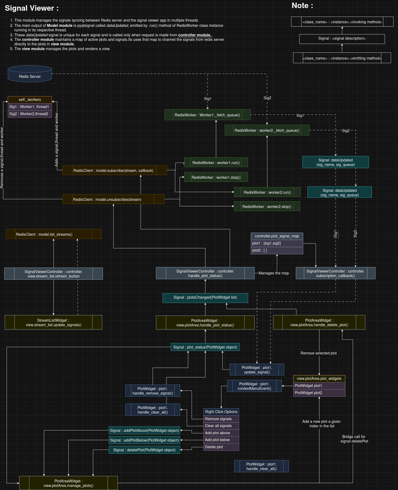
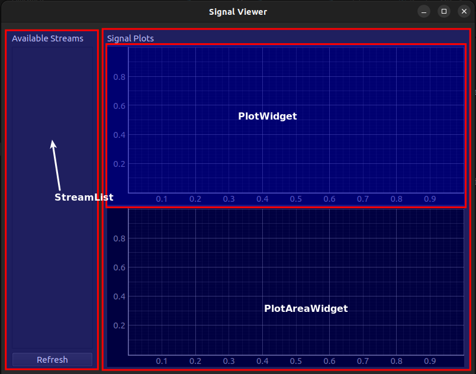

# Signal-Viewer

This is an application that fetches the signals from redis server hosted on localhost (127.0.0.1) at port 6379.This database can be monitored in <i>redisinsight</i> app.Three signals are streamed from the program <i>signal_emitter.py</i> (Adapter code) to the redis database server.

In the following picture, the three signals 'signal A','signal B' and 'signal C' can be seen in redis_insight.


The signals are captured by application and are then displayed in the screen.Here below is the working of the app.


## Usage

Ensure that redis server is installed in your system.If not you can follow the topic **Redis Server Installation**.<br>
Run this in the terminal 1:
```bash
python signal_emitter.py     # Simulates realtime Signalse
```

Run this in the terminal 2:
```bash
python main.py     # Starts the application
```
### Redis Server Installation

```bash
sudo apt update 
sudo apt install -y lsb-release curl gnupg 
curl -fsSL https://packages.redis.io/gpg | sudo gpg --dearmor -o /usr/share/keyrings/redis-archive-keyring.gpg 
sudo chmod 644 /usr/share/keyrings/redis-archive-keyring.gpg 
Echo "deb [signed-by=/usr/share/keyrings/redis-archive-keyring.gpg] https://packages.redis.io/deb $(lsb_release -cs) main" | sudo tee /etc/apt/sources.list.d/redis.list 

sudo apt update 
sudo apt install redis-stack-server 
```

Follow these steps to automatically start the redis server every time ubuntu starts:
```bash
sudo systemctl enable redis-stack-server 
sudo systemctl start redis-stack-server 
```

## System Architecture

You can paste the file in **System Architecture** folder in https://app.diagrams.net/ to edit/view the architecture of the system.<br>
To start understanding this architecture, Its recommended to follow this <i>main.py -> controller.py -> view.py/model.py</i>.<br>
Match the code and the map below to understand the code much better.



The app view description :<br>


## Requirements

- Python 3.7+
- `redis`
- `pyQt6`

Install dependencies:

```bash
pip install -r requirements.txt
```
## References

- https://www.tutorialspoint.com/pyqt/index.htm
- https://redis.io/insight/

## Future improvements:

- When the signals gets deleted from redis server while the application is running with those signals on the active plots, the application cannot adapt to it.This bug could be checked and removed. As of now the best policy is to remove all the signals and then refresh the signal list and then continue.
